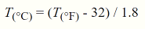

# Exercise 4: Classifying and converting temperatures

The exercise for this week is meant to help you to understand how to use functions in Python.
In this week's exercise you are asked to create a simple tool that converts temperatures from
one temperature-type to another and then classify those temperatures into specific temperature classes.

After making your changes, you will need to upload your files to GitHub.
The answers to the questions in this week's exercise should be given by modifying the document in places where asked or at the end of this document in the [section titled Answers](#answers).

- **Exercise 4 is due by the start of lecture on 4.10.**
- Don't forget to check out [the hints for this week's exercise](https://geo-python.github.io/2017/lessons/L4/exercise-4-hints.html) if you're having trouble.
- Scores on this exercise are out of 20 points.

## Problem 0 - Mid-term course feedback requested

Before you get started on the exercise, we'd like for you to take 5 minutes to provide us with some feedback on how the course is going so far.
This is the second time we're teaching the course in this format, and we would be very pleased to have your honest thoughts (positive or negative) about how things are going.
Feedback is **completely anonymous**.

[**Course feedback e-form**](https://elomake.helsinki.fi/lomakkeet/82679/lomake.html)

## Problem 1 - Simple temperature calculator (6 points)

In the first problem your aim is to create a function that converts the input temperature from degrees Fahrenheit to degrees Celsius.
Create a script called `functions.py` where you should write your code for Problem 1.

You should do following (also criteria for grading):

  - Create a function called `fahrToCelsius` in `functions.py`
  - The function should have one input parameter called `tempFahrenheit`
  - Inside the function, create a variable called `convertedTemp` to which you should assign the conversion result (i.e., the input Fahrenheit temperature converted to Celsius)
  - The conversion formula from Fahrenheit to Celsius is:
       - 
  - Return the converted value from the function back to the user
  - Comment your code and add a docstring that explains how to use your `fahrToCelsius` function (i.e., you should write the purpose of the function, parameters, and returned values)
  - Test and use your newly created function by finding the results for following questions:
     - What is 48° Fahrenheit in Celsius? **==> Add your answer here:**
     - What about 71° Fahrenheit in Celsius? **==> Add your answer here:**
  - Upload and commit your script with the name `functions.py` in your own GitHub repository for Exercise 4

If everything in your script is working properly the following test case should work:

  ```python
  >>> print("32 degrees Fahrenheit in Celsius is:", fahrToCelsius(32))
  32 degrees Fahrenheit in Celsius is: 0.0
  ```

### Questions for Problem 1

We would like you to think about and answer the following questions based on the materials and ideas that you learned during the lecture:

  1. Is the concept of function clear to you? If not, what do you not understand? (**0.25 points**)
  2. What are the benefits of using functions in your script? (**0.5 points**)
  3. Does it matter in which order the functions are written in a script? If you think it does, why? (**0.25 points**)

Write your answers to the [Answers](#answers) section at the end of this file.

## Problem 2 - Temperature classifier (7 points)

In [Problem 2 of last week's exercise](https://github.com/Geo-Python-2017/Exercise-3) we practiced classifying temperatures
into four different classes (*i.e., cold, slippery, comfortable, warm*). Let's continue working with the same idea.

 | Return value | Classification criteria                  |
 |---|-----------------------------------------------------|
 | 0 | temperatures below -2 degrees (Celsius)             |
 | 1 | temperatures from -2 up to +2 degrees (Celsius)  [1] |
 | 2 | temperatures from +2 up to +15 degrees (Celsius) [2] |
 | 3 | temperatures above +15 degrees (Celsius)            |

 [1] *Values -2 and +2 should belong to this class*

 [2] *Value +15 should belong to this class*

This function can be added to your `functions.py` script started in Problem 1.

You should do following (also criteria for grading):

  - Create a new function called `tempClassifier`
  - `tempClassifier` should have one parameter called `tempCelsius`
  - Your function should reclassify the input temperature based on the criteria in the table above
  - Return the reclassified value as an integer number (i.e., 0, 1, 2, or 3)
  - Add comments in your code and a docstring that explains how to use your `tempClassifier` function (i.e., you should write the purpose of the function, parameters, and returned value(s))
  - Test and use your newly created function by finding the results for following questions:
     - What is class value for 16.5 degrees (Celsius)? **==> Add your answer here:**
     - What is the class value for +2 degrees (Celsius)? **==> Add your answer here:**
  - Commit the changes to your `functions.py` script to your own GitHub repository for Exercise 4

## Problem 3 - Classify temperatures (7 points)

Finally, we can bring together the pieces that we have created thus far. In the last problem your aim is to take
advantage of your new functions and reclassify a dataset of temperatures in Fahrenheit into four different classes.
You should create a new script called `temp_analyzer.py` where you add all your code related to Problem 3.

The temperature values are provided in the [data.py](data.py) file that looks like following:

  ```
  # List of half-hourly temperature values (in degrees Fahrenheit) for one week
  # Showing first two rows
  tempData = [19, 21, 21, 21, 23, 23, 23, 21, 19, 21, 19, 21, 23, 27, 27, 28, 30, 30, 32, 32, 32, 32, 34, 34,
               34, 36, 36, 36, 36, 36, 36, 34, 34, 34, 34, 34, 34, 32, 30, 30, 30, 28, 28, 27, 27, 27, 23, 23, ]
  ```

### Overview

The analysis process has three main steps:

 1. Read in the data from [data.py](data.py) and iterate over the Fahrenheit temperatures
 2. Convert the Fahrenheit temperature to Celsius using your `fahrToCelsius` function from that was created in Problem 1
 3. Classify the converted temperature using the `tempClassifier` function that was created in Problem 2

In more detail, you should do following (also criteria for grading):

 - Create a new script called `temp_analyzer.py` and write all your code to that script from now on
 - In `temp_analyzer.py`, import the `tempData` from [data.py](data.py), which is a list of Fahrenheit temperatures (the list should have 336 values).
 - Also import the `fahrToCelsius` and `tempClassifier` functions from `functions.py`
 - Create an empty list called `tempClasses` (which will be filled with temperature class numbers later)
 - Iterate over the Fahrenheit temperature values in the `tempData` list (one by one) and:
    - Create a new variable called `tempCelsius` in which you should assign the temperature in Celsius using the `fahrToCelsius` function to convert the Fahrenheit temperature into Celsius.
    - Create a new variable called `tempClass` in which you should assign the temperature class number (0, 1, 2, or 3) using the `tempClassifier` function
    - Add the `tempClass` value to the `temp_classes` list
 - How many temperatures are there within each temperature class?
    - Count the number of zeros, ones, twos, and threes in the `tempClasses` list and print out the results at the end of your script
    - Tip: You might want to consider using a [`count()` function](https://www.tutorialspoint.com/python/list_count.htm) *OR* a `for` loop to handle this
 - Add comments in your code and a docstring at the beginning of your script that explains what the `temp_analyzer` script does and how it is used.
 - Commit your `temp_analyzer.py` script to your own GitHub repository for Exercise 4

# Answers

## Problem 1 - Answers to questions

### 1. 

### 2.

### 3. 


